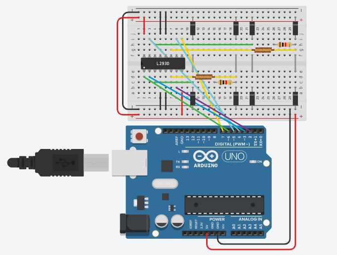

---
title: Control de velocidad en lazo abierto para un motor de CA
...
## Modelo

Para describir el comportamiento de un motor de corriente alterna, empezaremos por un caso simple que es el motor a pasos. 

*).](https://buildbotics.com/content/images/2019/09/4wireMotor.png){width=25%}

En la figura 1, podemos ver el diagrama esquemático de un motor a pasos bipolar. Para este caso simplificado vamos a asumir que solo tenemos un par de dientes en el rotor. Tenemos además dos devanados: A y B.

### Subsistema eléctrico

A partir de la figura 1, analizaremos primeramente el comportamiento del devanado A.

*)](https://es.mathworks.com/help/physmod/sps/powersys/ref/hystm_emf.gif){width=50%}

Como podemos apreciar en la figura 2a, el devanado A se puede describir por
medio de una resistencia ideal, una inductancia ideal y un alternador ideal. En
la figura 2b, podemos ver que el alternador ideal produce una [fuerza
contrelectromotriz](https://es.wikipedia.org/wiki/Fuerza_contraelectromotriz) de
forma sinusoidal. 

Si aplicamos la [segunda ley de Kirchhoff](https://es.wikipedia.org/wiki/Leyes_de_Kirchhoff#Ley_de_tensiones_de_Kirchhoff) al devanado, obtenemos la ecuación 

$$v_a = L_a \frac{di_a}{dt} + R_a i_a + e_a$$ {#eq:va}

donde $v_a$ es el voltaje de entrada en el devanado A del motor, $i_a$ es la
corriente a traves del devanado y $e_a$ es la fuerza contraelectromotiz
producida por el alternador ideal del devanado A. Por otro lado, la constante
$L_a$ es la inductancia del devanado y la constante $R_a$ es la resistencia del
devanado.

Al repitir el mismo procedimiento en el devanado B, obtenemos la ecuación

$$v_b = L_b \frac{di_b}{dt} + R_b i_b + e_b$$ {#eq:vb}

donde $v_b$ es el voltaje de entrada en el devanado B del motor, $i_b$ es la
corriente a traves del devanado y $e_e$ es la fuerza contraelectromotiz
producida por el alternador ideal del devanado B. Por otro lado, la constante
$L_b$ es la inductancia del devanado y la constante $R_b$ es la resistencia del
devanado.

### Susbsistema mecánico

Por otro lado, para describir el comportamiento mecánico, aplicamos la [segunda
ley de Euler para el
movimiento](https://en.wikipedia.org/wiki/Euler%27s_laws_of_motion#Euler's_second_law)
al rotor, con lo que obtenemos la expresión

$$J\frac{d\omega}{dt} = \tau_D - B\omega - \tau_L$${#eq:rotor}

donde $\omega$ es la velocidad angular del rotor, $\tau_D$ es el par motor
desarrollado sobre el rotor y $\tau_L$ es el par de la carga. Además, la
constante $J$ es el momento de inercia del rotor y $B$ es la fricción viscosa
rotacional.

### Interacciones

Por si mismas las ecuaciones (@eq:va), (@eq:vb) y (@eq:rotor) no nos permiten
describir completamente el comportamiento del motor. Para ello, requerimos
también de las interacciones que ocurren entre los subsistemas eléctrico y
mecánico.

La [acción del subsistema mecánico al
devanado A](https://core.ac.uk/download/pdf/148670797.pdf#page=39) está dada por
la ecuación

$$e_a = -K_m \omega \sin (P\theta)$${#eq:ea}

donde $\theta$ es el ángulo que el rotor se desplaza, y su relación con la
velocidad angular está dado por la ecuación

$$\frac{d\theta}{dt}=\omega.$$

La constante $K_m$ es la constante del motor, y la constante $P$ en el número de
pares de dientes que tiene el rotor.

En cuanto al caso del devanado B tenemos la ecuación

$$e_b = K_m \omega \cos (P\theta)$${#eq:eb}

Por otro lado, la [reacción del subsistema eléctrico en el
rotor](https://core.ac.uk/download/pdf/148670797.pdf#page=41) está dada por la
expresión

$$\tau_D = -K_m i_a \sin P\theta + K_m i_b \cos P\theta.$${#eq:tau}

### Modelo dinámico

A partir de las ecuaciones anteriores, podemos obtener un conjunto de ecuaciones
diferenciales lineales no homogéneas. Por ejemplo, partiendo de (@eq:va) y
(@eq:ea), podemos obtener la ecuación

$$L_a \frac{di_a}{dt} + R_a i_a = v_a + K_m \omega \sin (P\theta).$${#eq:dia}

Para el caso de (@eq:vb) y (@eq:eb), al reorganizarla tenemos

$$L_b \frac{di_b}{dt} + R_b i_b = v_b - K_m \omega \cos (P\theta).$${#eq:dib}

Y finalmente, con las ecuaciones (@eq:rotor) y (@eq:tau) obtenemos

$$J\frac{d\omega}{dt} + B\omega = - K_m i_a \sin (P\theta) + K_m i_b \cos (P\theta) - \tau_L.$${#eq:dw}

## Control de velocidad en lazo abierto

Para implementar un control de velocidad en lazo abierto para un motor de CA,
construiremos un par de entradas, $v_a$ y $v_b$, que permitan tener una
velocidad constante en la salida. Para ello, propondremos como paso intermedio
las corrientes 

$$i_a = -I_p \sin P\theta$${#eq:ia}
$$i_b = I_p \cos P\theta$${#eq:ib}

donde $I_p$ es una corriente constante.

Se sustituye en (@eq:dw) las ecuaciones (@eq:ia) y (@eq:ib), con lo que
obtenemos la expresión

$$J\frac{d\omega}{dt} + B\omega =  K_m I \sin^2 P\theta + K_m I \cos^2 P\theta -
\tau_L$$

la cual puede ser reducida a

$$J\frac{d\omega}{dt} + B\omega =  K_m I - \tau_L.$${#eq:dwlineal}

Si asumimos que $\tau_L$ es constante, entonces la velocidad del rotor en estado
estacionario será constante. Por lo tanto, las corrientes definidas en (@eq:ia)
y (@eq:ib) funcionan para regular la velocidad del rotor.

Ahora debemos obtener los voltajes de entrada para obtener (@eq:ia) y (@eq:ib).
Para ello, aplicamos inicialmente (@eq:ia) y (@eq:ea) a (@eq:va), con lo que
obtenemos

$$v_a = -L_a I P\omega \cos P\theta - (R_a I + K_m \omega) \sin (P\theta).$${#eq:input}

Para simplificar dicah expresión, usaremos la [identidad trigonométrica para la
combinación lineal de seno y
coseno](https://en.wikipedia.org/wiki/List_of_trigonometric_identities#Sine_and_cosine),
y obtenemos

$$v_a = -V_p \cos(P\theta + \phi)$$

donde

$$V_p = \sqrt{(L_a I P\omega )^2 + (R_a I + K_m \omega)^2}$$

$$\phi = \arctan\left(\frac{R_a I + K_m \omega}{L_a I P\omega}\right)$$

Una vez obtenida $v_a$, falta hacer el mismo trabajo para $v_b$. Queda como
ejercicio para el lector realizar el mismo trabajo. Sin embargo el resultado
será similar. En pocas palabras, aplicando las señales

$$v_a = -V_p \cos(P\omega t + \phi)$$
$$v_b = V_p \sin(P\omega t + \phi)$$

con una frecuencia constante, la velocidad del rotor se debe regular a la misma
frecuencia.

Para la implementación de un controlador similar para el caso monofásico, se
puede ver el siguiente video.

<iframe width="560" height="315" src="https://www.youtube.com/embed/I3MjAyZ-Tn0" title="YouTube video player" frameborder="0" allow="accelerometer; autoplay; clipboard-write; encrypted-media; gyroscope; picture-in-picture" allowfullscreen></iframe>

## Implementación

A continuación se presentará una implementación simple de un
inversor bifásico para un motor a pasos. Utilizamos una
tarjeta [Arduino UNO](https://store.arduino.cc/usa/arduino-uno-rev3) para
desarrollar la aplicación.

En la figura 3, podemos ver el circuito de inversor bifásico para un motor a
pasos. Por limitaciones de la plataforma, tuvimos que sustituir cada devanado
del motor a pasos con un inductor y una resistencia. Como ya mencionamos,
utilizamos una tarjeta Arduino UNO. Para la etapa de potencia, nos valimos del
circuito integrado [L293D](https://www.ti.com/lit/ds/symlink/l293d.pdf), que
contiene 4 medios puentes H.

Para ver el circuito y el código del modelo de la figura 3, pueden revisar el
siguiente [enlace en
TinkerCAD.](https://www.tinkercad.com/things/f8KcIgQaXO9-fantastic-luulia-albar/editel?sharecode=zhruNH-anu7aVYLOEv2M0_MduvVZuNjC5G45cn84JnY)

### Código para Arduino UNO

Si bien es posible desarrollar código para Arduino en el lenguaje C, tenemos que
es más accesible usar la entorno [Wiring](http://wiring.org.co/) empleado por la
tarjeta. Sin embargo, Wiring se soporta por medio del lenguaje C++ y
aprovecharemos algunas de las capacidades propias del mismo lenguaje.

El código desarrollado se muesta en el siguiente listado.

<<two-phase-inverter.ino>>=
/// @file   two-phase-inverter.ino
/// @author Gastón Hugo Salazar Silva <ghsalazar@ipn.mx>

@

<<two-phase-inverter.ino>>=
const int ENABLE_1 = 1 << 6;
const int ENABLE_2 = 1 << 7;
const int OUTPUTS  = 0b1111 << 2;

@

<<two-phase-inverter.ino>>=
const int STATES   = 0b11;

@

<<two-phase-inverter.ino>>=
const int output[] { 
  0b1001 << 2,
  0b1010 << 2,
  0b0110 << 2,
  0b0101 << 2
};

@

<<two-phase-inverter.ino>>=
void setup()
{
  DDRD = ENABLE_2 | ENABLE_1 | OUTPUTS; //Setting pins for output
}

@

<<two-phase-inverter.ino>>=
void loop()
{
@

<<two-phase-inverter.ino>>=
  static int state = 0;

@

<<two-phase-inverter.ino>>=
  state = (++state) & STATES;
@

<<two-phase-inverter.ino>>=
  PORTD = ENABLE_2 | ENABLE_1 | output[state];
@

<<two-phase-inverter.ino>>=
  delay(1000); // Wait for 1000 millisecond(s)
}
@

## Para saber más

* [How to Wire Stepper Motors](https://buildbotics.com/wiring-stepper-motors/)
* [Arduino Bipolar Stepper Motor Control](https://simple-circuit.com/arduino-bipolar-stepper-motor-control/)
* [L293D Quadruple Half-H Drivers](https://www.ti.com/lit/ds/symlink/l293d.pdf)
* [L298N Dual Full-Bridge Driver](https://www.sparkfun.com/datasheets/Robotics/L298_H_Bridge.pdf)